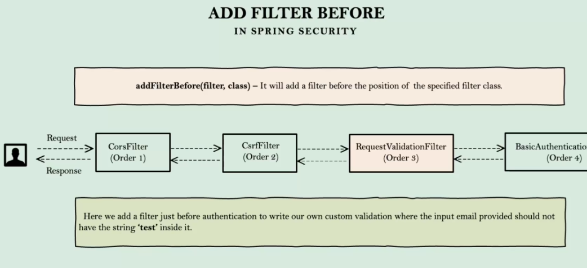

* Filter interface
* GenericFilterBean
* OncePerRequestFilter

**MATCHERS:**
1) MVC (mvcMatchers) 
-> ** Any number of paths
-> * Single path
2) ANT (antMatchers) - Very old matcher
3) REGEX (regexMatchers)