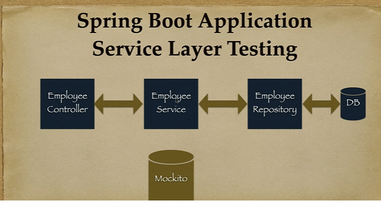
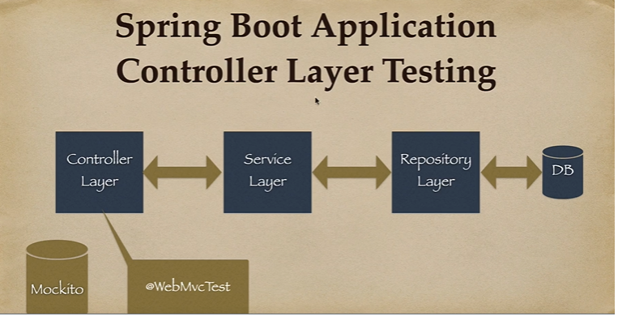

@DataJpaTest - annotation for repository layer test.
@DisplayName - Provide custom name for test cases
@BeforeEach - To put common code for all test cases
@WebMvcTest - Controller layer testing
@SpringBootTest - Integration testing (Loads all beans)

JPQL - Java Persistence Query Language.
Hamcrest Library - Provides 'is' method
jsonpathLibrary - reading json documents
BDD style naming convention for test case names.
    @Test
    public void given_when_then() {

    }

